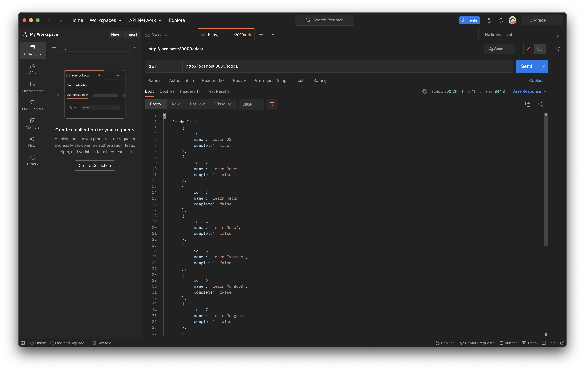

# Todo-list Backend



## Table of Contents

- [Todo-list Backend](#todo-list-backend)
  - [Table of Contents](#table-of-contents)
  - [Description](#description)
  - [Installation](#installation)

---

## Description

This is a simple todo-list backend. It is written in JavaScript and uses Express and NodeJS as a web framework.
The data is stored in a file locally which can be accessed [`here`](/store/todos.json).

## Installation

To install the dependencies, run the following command:

```bash
npm install
```
